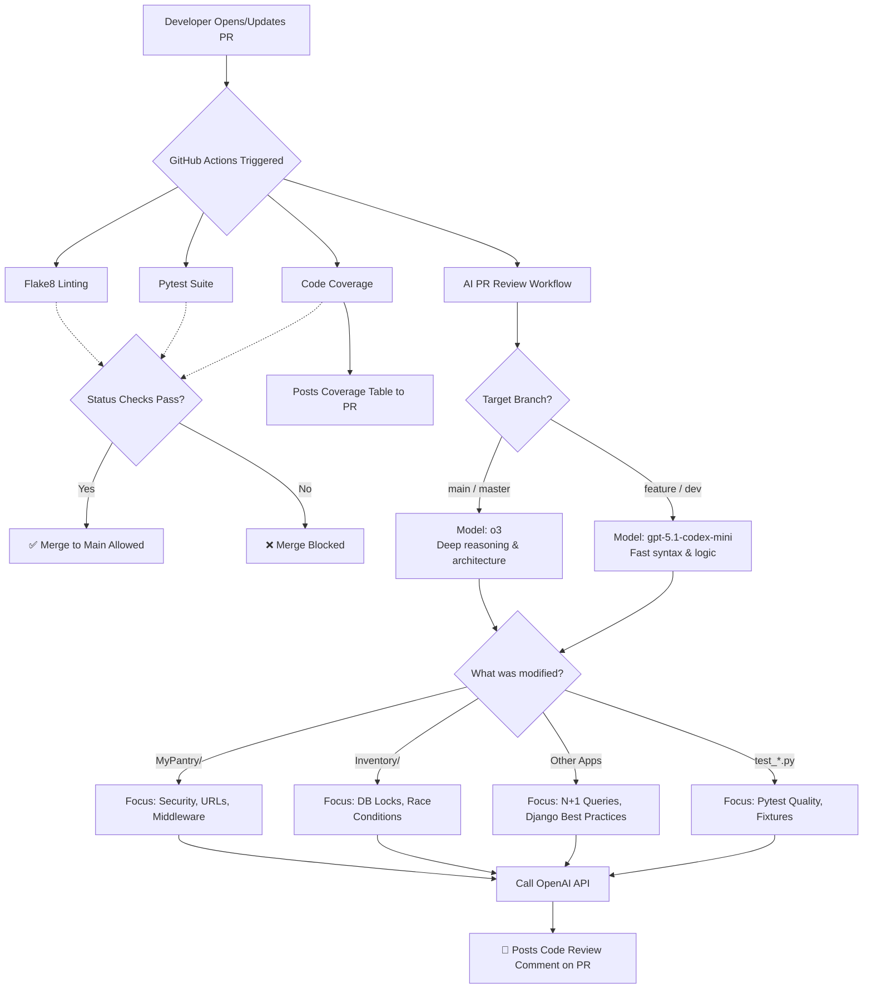

# CI/CD & AI Code Review Pipeline (Overengineered)

This repository is equipped with an automated CI/CD pipeline built on GitHub Actions. Every Pull Request triggers a suite of tests, linters, and an intelligent AI code review to ensure high code quality, security, and adequate test coverage before any code is merged into `main`.

## Pipeline Architecture Flow

---

## Workflow Breakdowns

### 1. AI Pull Request Review

Instead of waiting for a human to do the first pass, our custom AI workflow automatically analyzes your code and leaves a review comment on your Pull Request.

* **Cost & Token Optimized:** The workflow completely ignores auto-generated files (`migrations/`, `.venv/`, `__pycache__/`) and static assets (`docs/`, `static/`) so the AI only reads actual Python application logic.
* **Smart Model Routing:**
* **Feature Branches:** Uses `gpt-5.1-codex-mini` for fast, code-optimized syntax checking.
* **Production Merges (`main`):** Automatically upgrades to OpenAI's `o3` reasoning model for deep architectural and security reviews.

* **Context-Aware Prompting:** The AI dynamically changes its review criteria based on the folders you edit. For example, editing the `Inventory` app triggers strict checks for database race conditions, while editing `MyPantry` triggers security and middleware checks.

### 2. Code Quality & Testing (Strict Gates)

We enforce three strict status checks on all Pull Requests. **These must pass before the "Merge" button is unlocked:**

* **Flake8 Linting:** Fails the PR if there are Python syntax errors, undefined names, or severe PEP8 formatting violations.
* **Pytest:** Runs the entire Django test suite to ensure no existing logic was broken.
* **Code Coverage:** Enforces a strict **80% minimum coverage** rule. If your PR drops coverage below 80%, it will fail. A bot will automatically comment on your PR with a table showing exactly which lines of code are missing tests.

---

## For Developers: How to interact with the CI

1. **Do not format for the AI:** The AI is specifically instructed *not* to nitpick PEP8 formatting. Let Flake8 handle styling; the AI is there for business logic and architecture.
2. **Coverage failures:** If your PR fails the coverage check, look for the automated comment from `github-actions[bot]`. It will tell you exactly which files need more Pytest coverage.
3. **Draft PRs:** If you are pushing WIP (Work In Progress) commits and don't want to waste CI minutes or AI tokens, consider prefixing your commit messages with `[skip ci]` or opening the PR as a "Draft" until you are ready for the automated review.

---

## For Maintainers: Adding a New Django App

If you create a new Django app (e.g., `Payments`), it will automatically receive the **Generic Django AI Review** (checking for N+1 queries, fat-models, etc.). You do not need to update the workflows.

**However, if the new app requires highly specialized AI instructions:**

1. Open `.github/workflows/ai-pr-review.yml`.
2. Locate the `env:` Configuration Block at the top of the `ai-review` job.
3. Add a new variable like `CUSTOM_APP_2_FOLDER: "Payments"` and `CUSTOM_APP_2_RULES: "Strictly check Stripe API keys..."`.
4. Add a quick `elif` statement in the routing bash script to point to your new variables.
